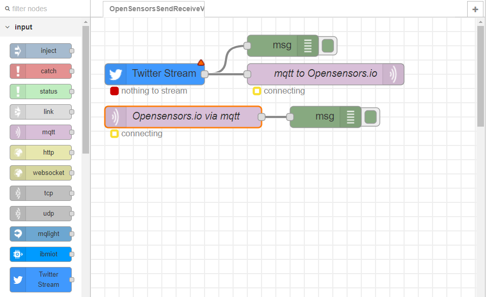
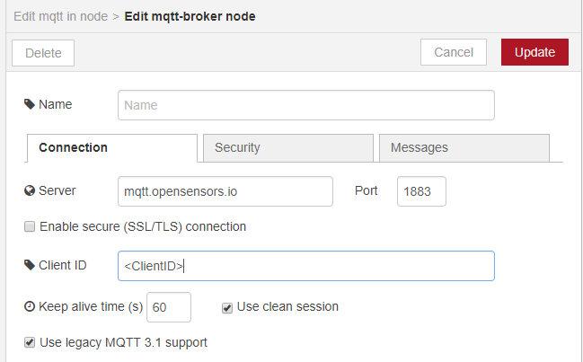

OpenSensorsSendReceiveViaMQTT
=============================

### About

This flow sends data payloads from Node-Red to the [OpenSensors](https://www.opensensors.com/) IoT platform in real-time via the [MQTT protocol](http://mqtt.org/). In order to access the OpenSensors you will need to sign up to OpenSensors register your app as a device on the platform. In this case Tweets were collected and posted to a topic `/users/<Username>/tweets` using port `1883` on the server `mqtt.opensensors.io`. You will need to provide the registered device's ClientID along with your OpenSensors login credentials to successfully establish the connection. You can also subscribe to a real-time feed of posted data using the same topic.

**Note:** In order to use the Twitter Stream Node the user will need to sign up for a Twitter developer account and set up a Twitter app. See [Twitter developer apps: Overview](https://developer.twitter.com/en/docs/basics/apps/overview).
